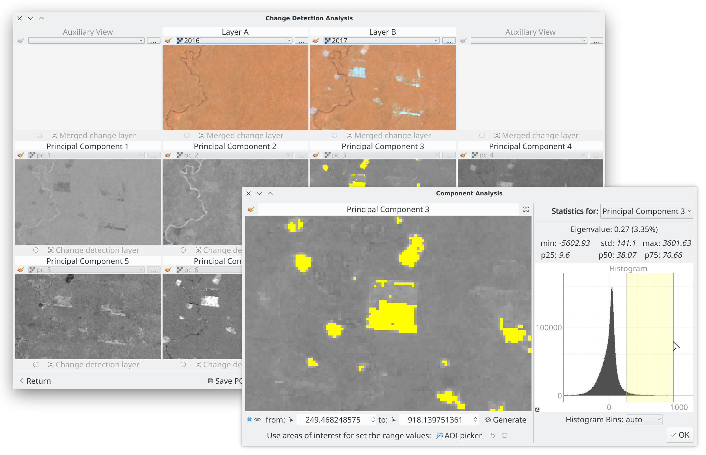

# PCA4CD - PCA for change detection


The PCA4CD is a Qgis plugin to build the change detection layer using the principal components method. Designed mainly with the goal of:

1. generate or load the principal components (PCA)
2. and build the change detection layer based on the dimensionality reduction properties.



Read more in: [https://smbyc.github.io/PCA4CD](https://smbyc.github.io/PCA4CD)

## Installation

The plugin can be installed using the QGIS Plugin Manager, go into Qgis to `Plugins` menu and `Manage and install plugins`, in `All` section search for `PCA4CD`.

The plugin will be available in the `Plugins` menu and `Plugins toolbar`.

> *Warning:* 
    This plugin only works in Qgis version >= 3.4, is very recommended use the latest available version of Qgis 3 with Python environment 3.7 due to the dependencies and some problems with Dask library.

### Additional Python packages

PCA4CD requires additional Python packages, that are generally not part of QGIS's Python. These are:

* Python-Dask
* PyQtGraph

The way for have that:

#### Auto install the dependencies

The plugin install automatically it when is installing or updating, it will be installed into a separate folder specific to PCA4CD and will not influence any existing Python installation or Qgis environment:

    >Windows: ~\AppData\Local\pca4cd\  
    >macOS: ~/Library/Application Support/pca4cd/  
    >Linux: ~/.local/share/pca4cd/

#### Install the dependencies before - Linux (and Mac)

Before install the plugin, install the dependencies in your system python, but it depends on the operating system, E.g. for Ubuntu and derivatives distributions:

    >sudo apt install python3-pyqtgraph python3-dask

#### Package all-in-one - Windows 64bits

For Windows users download and reinstall the plugin with [this zip all-in-one](https://drive.google.com/uc?export=download&confirm=gzst&id=1YU65HYQUKQX5GpVsSH8GkCfGiqnV8Wez) with all the libs and dependencies inside. This should work directly without any additional steps with a Qgis version >= 3.18 on a 64bit Windows system, if you have issues with this try with the alternative installation below.

> *Note:* For uninstall/reinstall/update this plugin using this all-in-one in Windows, you must first deactivate, restart Qgis, uninstall/reinstall/update it and finally activate it again.

#### Using Conda

If you have problems with the dependencies, the best options to solve it is use [conda](https://docs.conda.io/en/latest/miniconda.html) and install Arosics and Qgis (from the conda shell):

```bash
conda install -c conda-forge dask pyqtgraph qgis
```

After that open Qgis from the shell with `qgis` command. Then install the plugin.

## Source code

The official version control system repository of the plugin:
[https://github.com/SMByC/PCA4CD](https://github.com/SMByC/PCA4CD)

The home plugin in plugins.qgis.org: [https://plugins.qgis.org/plugins/pca4cd/](https://plugins.qgis.org/plugins/pca4cd/)

## Issue Tracker

Issues, ideas and enhancements: [https://github.com/SMByC/PCA4CD/issues](https://github.com/SMByC/PCA4CD/issues)

## About us

PCA4CD was developing, designed and implemented by the Group of Forest and Carbon Monitoring System (SMByC), operated by the Institute of Hydrology, Meteorology and Environmental Studies (IDEAM) - Colombia.

Author and developer: *Xavier Corredor Ll.*  
Theoretical support, tester and product verification: SMByC-PDI group

### Contact

Xavier Corredor Ll.: *xcorredorl (a) ideam.gov.co*  
SMByC: *smbyc (a) ideam.gov.co*

## License

PCA4CD is a free/libre software and is licensed under the GNU General Public License.
