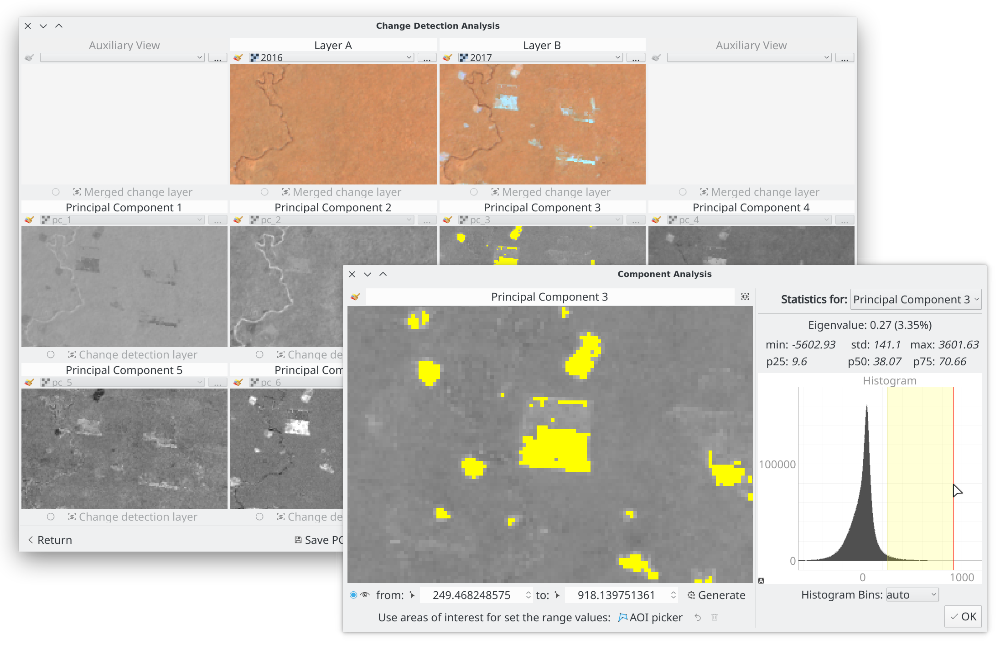

# PCA4CD - PCA for change detection


PCA4CD is a QGIS plugin that computes Principal Component Analysis (PCA) and builds change detection layers using PCA's dimensionality reduction properties:

1. Generate (or load) the principal components of the input layers
2. (Optional) Build a change detection layer from the components



Read more at: [https://smbyc.github.io/PCA4CD](https://smbyc.github.io/PCA4CD)

## Installation

The plugin bundles its required Python dependencies and should work out of the box:

* Dask
* PyQtGraph

> **Requirements:** QGIS >= 3.18. Compatible with both QGIS 3.x (Qt5/PyQt5) and QGIS 4.x (Qt6/PyQt6).

If dependency loading fails, install them manually using [conda](https://docs.conda.io/en/latest/miniconda.html):

```bash
conda install -c conda-forge dask pyqtgraph qgis
```

Then open QGIS from the conda shell with the `qgis` command and install the plugin.

## Source code

Source code, issue tracker, and ideas: [https://github.com/SMByC/PCA4CD](https://github.com/SMByC/PCA4CD)  
Plugin page: [https://plugins.qgis.org/plugins/pca4cd/](https://plugins.qgis.org/plugins/pca4cd/)

## About us

PCA4CD was developed and implemented by the Group of Forest and Carbon Monitoring System (SMByC), operated by the Institute of Hydrology, Meteorology and Environmental Studies (IDEAM) — Colombia.

Author and developer: *Xavier C. Llano* *<xavier.corredor.llano@gmail.com>*  
Theoretical support, testing and product verification: SMByC-PDI group

## License

PCA4CD is free/libre software licensed under the GNU General Public License.
