# PCA4CD

The PCA4CD is a Qgis plugin to calculate Principal Component Analysis (PCA) and (optional) build the change detection layer based on the dimensionality reduction properties of PCA. Designed mainly with the goal of:

1. Generate (or load) the principal components (PCA) of the input layers
2. (optional) Build the change detection layer based on the dimensionality reduction properties of PCA.

First, the main window is divided by two sections:

* [Compute the principal components](#1a-compute-the-principal-components)
* [Load the principal components](#1b-load-the-principal-components)

The following steps are:

* [Change Detection Analysis](#2-change-detection-analysis)
  * [Generate the change layer by component](#2a-generate-the-change-layer-by-component)
  * [Generate the merge change layer](#2b-generate-the-merge-change-layer)

## 1a. Compute the principal components

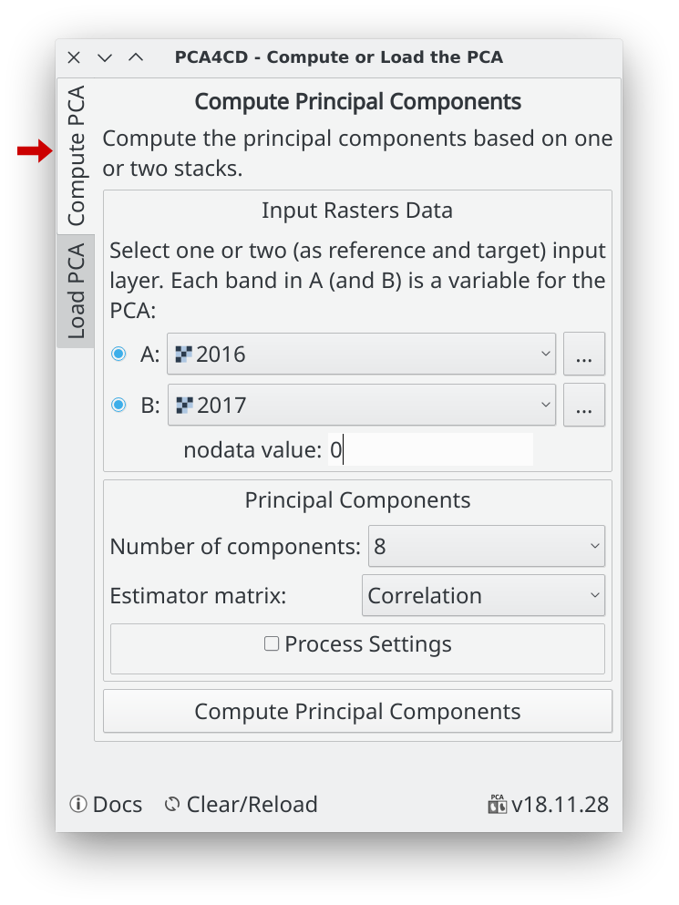

### Input layers

Select one or two input layer with or without multi-bands. If you use one layer (A) you must have all bands to process in it, instead if you want, for example, analysis two different periods for the same region is better use two layers, you can put the reference layer in (A) and the target layer in (B).

> *Warning:* 
    If use A and B layers,the plugin required that both layers have the same extent, the same pixel size and same projection.

Is important to know that each band in A (and B if enabled) is a variable for PCA, then the maximum number of components for compute is the total of bands in A (plus bands in B).

### Nodata value

The no data value is very important to set if the image have no valid value, else the PCA will be very affected by it. The nodata value set automatically from the stack A if this has the nodata value set as metadata inside the file.

### The estimator matrix

Use _Correlation_ or _Covariance_ depend on the data and of type of data (by default and recommended is the correlation). Some points about the use of these two specific estimators in the dimensionality reduction process:

* The covariance is dependent on the scale of the variables

* The correlation coefficients are insensitive to the variation of the dispersion of the data, so the covariance produces structures of better defined factors (Tinsley & Tinsley, 1987)

* Use covariance to preserve variance if the range and scale of the variables are similar or in the same units of measure.

* Use the correlation when the range within the variable and the scale differ widely (variables such as temperature, pressure, humidity, etc.)

### Process settings

To compute the principal components for a image, like a Landsat scene or bigger, required relatively a heavy computation, **the PCA4CD compute the PCA in parallel process** for reducing the time and the memory usage. However, good free RAM memory is required for not crash in the process, if this happens, try to use lower values in these parameters.

## 1b. Load the principal components

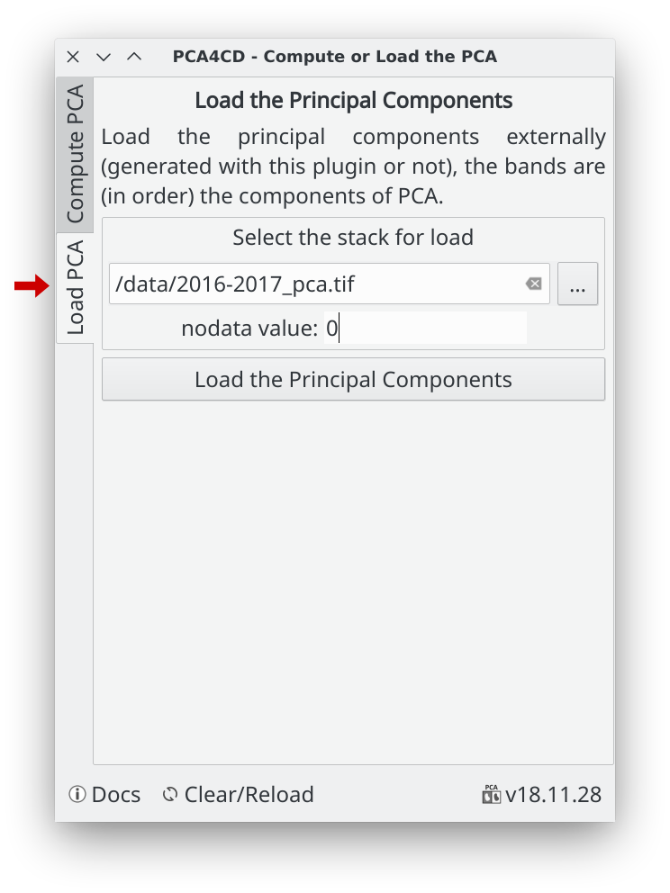

This is for analysis and creates the change layer of the principal components already generated, then you must load the principal components externally, this could have been generated with this plugin or not, but is important that bands are in order respect to the components of PCA.

The no data value is very important to set if the image have no valid value. The nodata value set automatically from the stack A if this has the nodata value set as metadata inside the file.

## 2. Change Detection Analysis

After compute or load the principal components, the plugin open the following change detection analysis dialog:

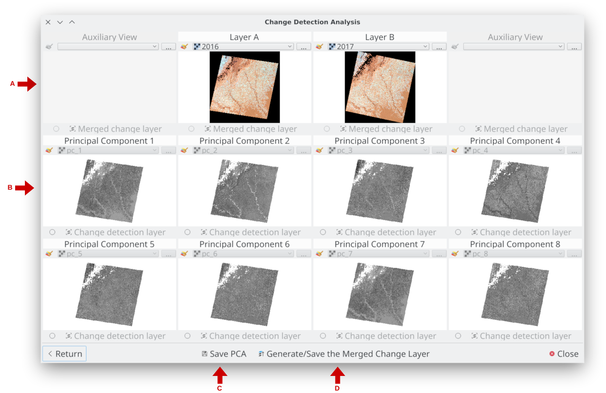

**A. Principal row:** In the center in the first row, the original input layer A (and B) is shown, these could be used as a reference of analysis, however you can change it if you want.

**B. Components rows:** The next rows are for the principal components computed or loaded. The size of the dialog is changed based of the number of principal components.

**C. Save PCA:** (Optional) This button is for save all the principal components generated as bands in one stack.

**D. Generate/Save the Merged Change Layer:** Merge all created and activated change layers of the principal components views (use this as the last step of the process, see below)

### 2a. Generate the change layer by component

Use the principal row (input and auxiliary layers) in the "change detection analysis" dialog to find and choose the better components (one or more) that capture the changes you want.

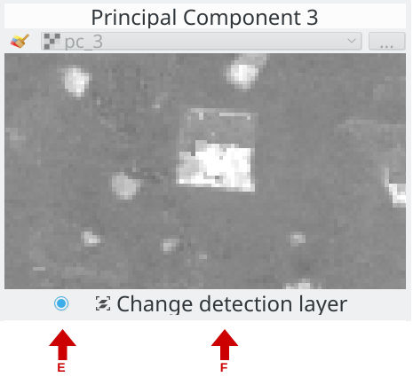

In this example, I picked the component 3 and 8

**E. Enable/disable the change layer:** When the change layer is created this is useful for show/hide the change layer. You must activate this for enable the "change detection layer" (F) button.

**F. Change detection layer:** This open the "Component Analysis" dialog for this principal component.

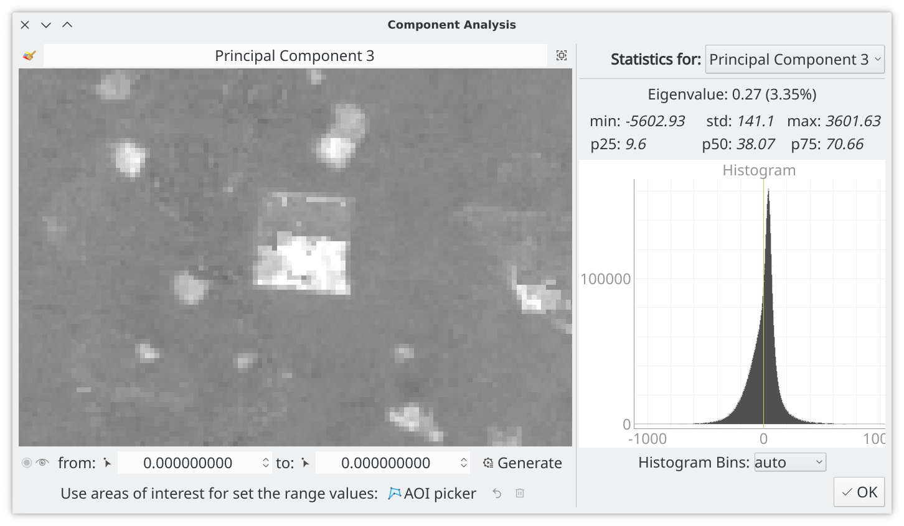

With this dialog, you can generate the change detection layer using a range of values (lower and upper). The plugin provides three ways for choosing the correct range of values depends on you looking for.

1. **Using the mouse picker:** Pick the value using the mouse over the image using the _from value_ picker and _to value_ picker mouse tool. The value is fixed using the left mouse button. When the two values are set, click in _Generate_ for compute the change detection layer.

    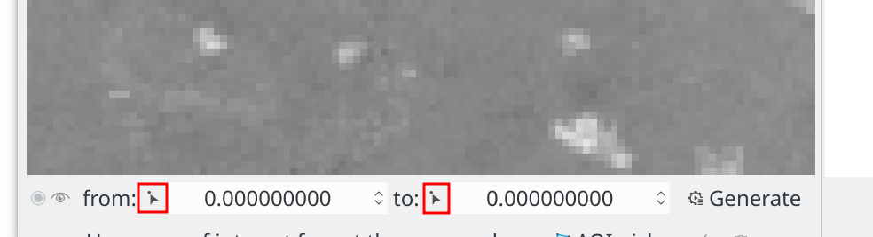

2. **Using AOI picker:** You can use several areas of interest using the AOI picker to capturing the values in the image that represent the change you want of this component. The plugin updates the statistics automatically for the pixels inside the AOIs and computes the minimum and maximum as the range of the change detection layer.

    Tips for the AOI picker: _left mouse button_ for create new point of the AOI, _esc_ or _backspace_ keyboard key for delete the last point, _right mouse button_ for finish the current AOI. The change detection layer is automatically created/updated every new AOI.

    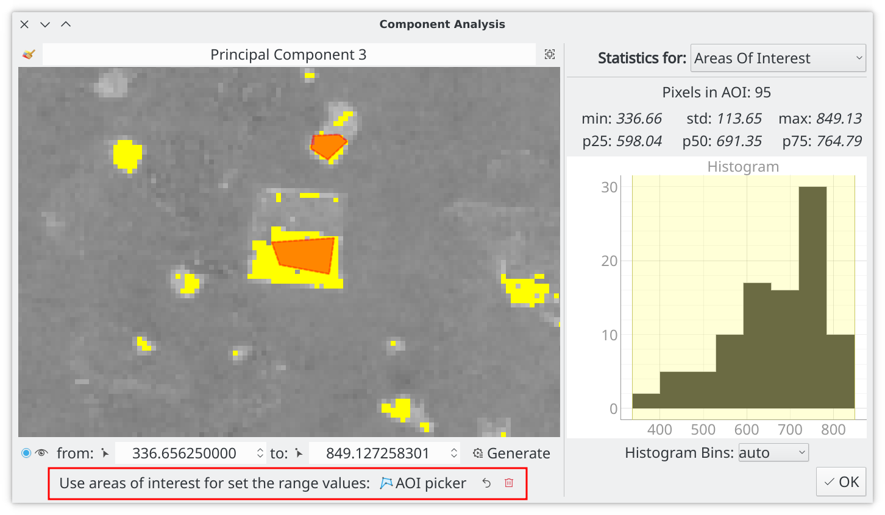

3. **Using the histogram:** The histogram is interactive, you can zoom in/out and stretch. The range values is the yellow area, you can change it manually with the mouse, when the yellow area is changed the range values change automatically (and vice versa), then do click in _Generate_ for compute the change detection layer.

    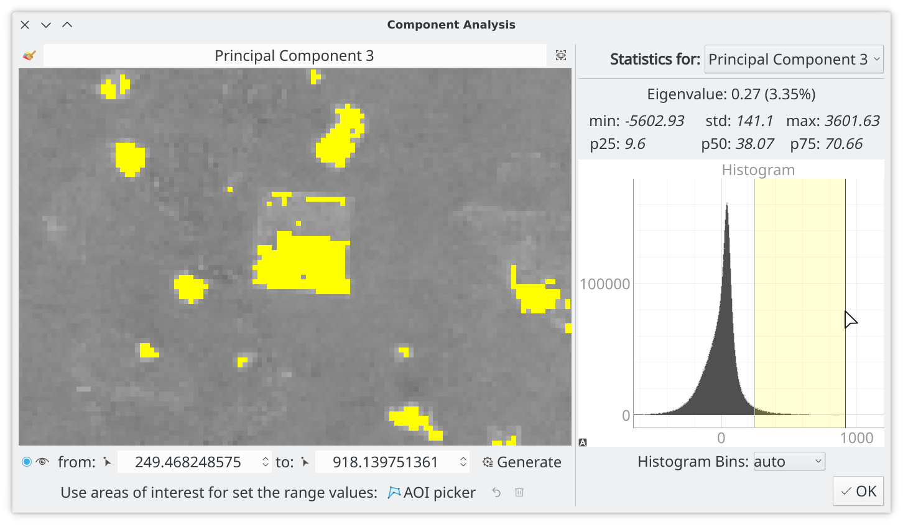

### 2b. Generate the merge change layer

When you have generated all change layers by components, you must active/enable the change detection layers (E button) for all layer that you want inside the final change layer.

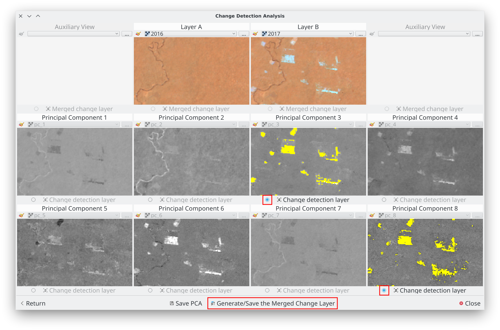

then do click on "Generate/Save the Merged Change Layer" button, this open the merge dialog:

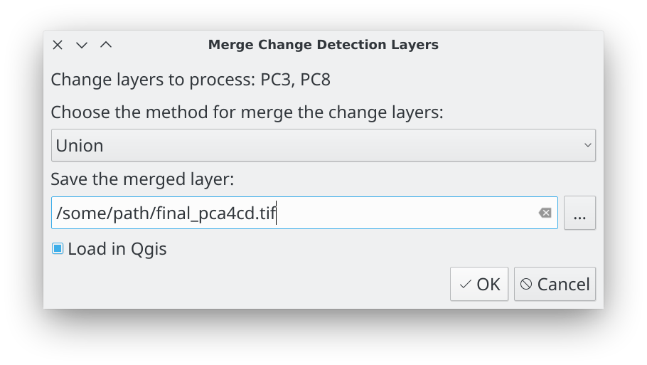

Choose the method for merge, select the file for store the final merge layer and do click in Ok button.

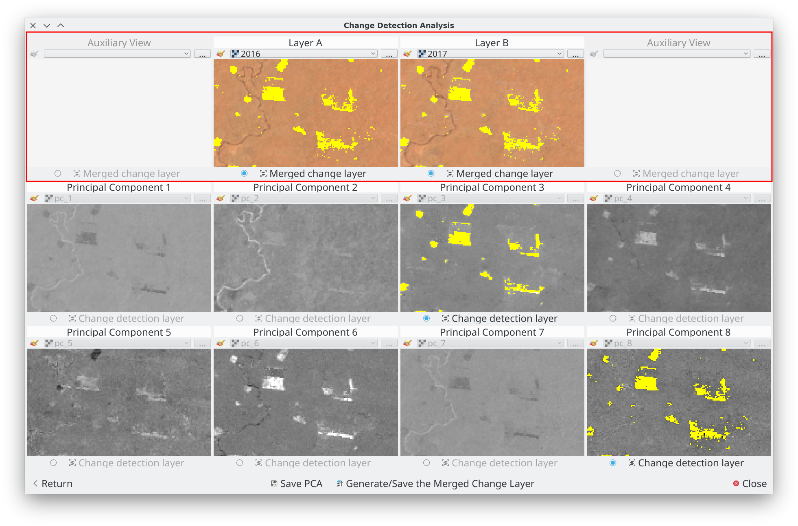

The merged change layer is saved and loaded for all view in the first row, is loaded (if was activated) in Qgis too. You can adjust/regenerate it changing the detection layer by components and merge again.

Finally, you can close the plugin and continue the analysis and adjustments of the final layer in Qgis.

## About us

PCA4CD was developing, designed and implemented by the Group of Forest and Carbon Monitoring System (SMByC), operated by the Institute of Hydrology, Meteorology and Environmental Studies (IDEAM) - Colombia.

Author and developer: *Xavier C. Llano* *<xavier.corredor.llano@gmail.com>*  
Theoretical support, tester and product verification: SMByC-PDI group

## License

PCA4CD is a free/libre software and is licensed under the GNU General Public License.
