# PCA4CD

PCA4CD is a QGIS plugin that computes Principal Component Analysis (PCA) and builds change detection layers using PCA's dimensionality reduction properties. The workflow has two stages:

1. Generate (or load) the principal components of the input layers
2. (Optional) Build a change detection layer from the components

The main window handles the first stage:

* [Compute the principal components](#1a-compute-the-principal-components)
* [Load the principal components](#1b-load-the-principal-components)

The second stage:

* [Change Detection Analysis](#2-change-detection-analysis)
  * [Generate the change layer by component](#2a-generate-the-change-layer-by-component)
  * [Generate the merged change layer](#2b-generate-the-merged-change-layer)

## 1a. Compute the principal components

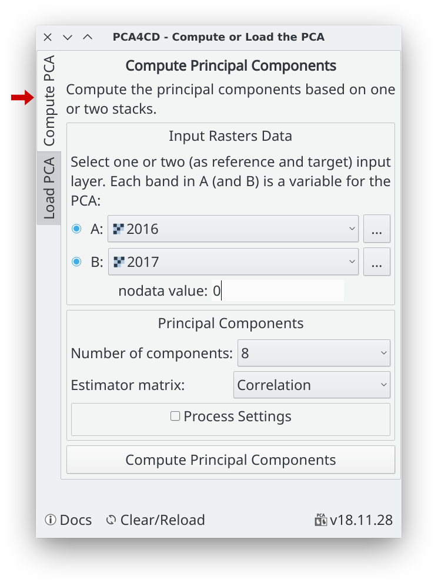

### Input layers

Select one or two raster layers (each can be single or multi-band). Use a single layer (A) when all bands to analyze are already stacked. Use two layers (A + B) when comparing two time periods — place the reference image in A and the target in B.

> **Note:** When using both A and B, both layers must share the same extent, pixel size, and projection.

Each band in A (and B, if enabled) is one variable for the PCA, so the maximum number of components equals the total band count across both layers.

### Nodata value

Always set the nodata value if the image contains invalid pixels — incorrect or missing nodata will distort the PCA. The value is auto-detected from layer A's file metadata when available.

### Estimator matrix

Choose _Correlation_ (default, recommended) or _Covariance_ based on your data:

* **Covariance** is scale-dependent — use it when all variables share the same units and similar value ranges, as it preserves the original variance structure.
* **Correlation** normalizes each variable to unit variance — recommended when variables have different scales or units (e.g., temperature, pressure, multiple spectral bands). Correlation is insensitive to differences in dispersion, producing more stable factor structures (Tinsley & Tinsley, 1987).

### Process settings

Computing PCA on large images (e.g., a full Landsat scene) is computationally intensive. **PCA4CD runs the computation in parallel** to reduce processing time and memory usage. If the process runs out of memory, reduce the thread count or block size in these settings.

## 1b. Load the principal components

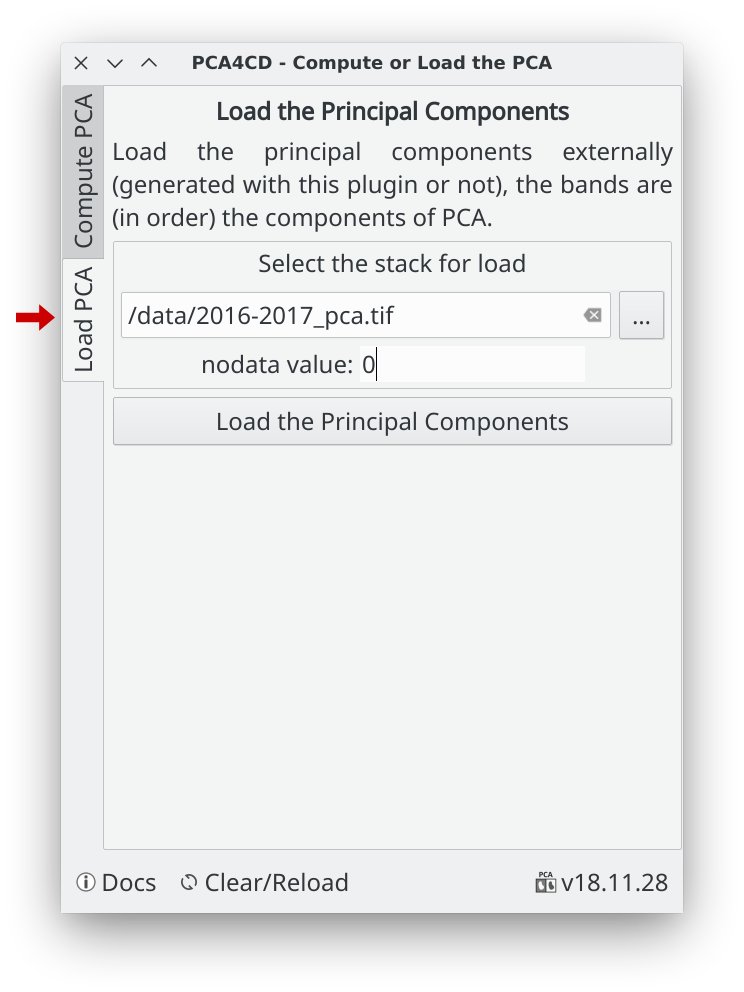

Use this section to load a pre-computed PCA stack — generated by this plugin or any other tool — and go directly to change detection. The bands must be ordered to match the PCA component sequence.

Set the nodata value if applicable; it is auto-detected from the file metadata when present.

## 2. Change Detection Analysis

After computing or loading the principal components, the change detection dialog opens:

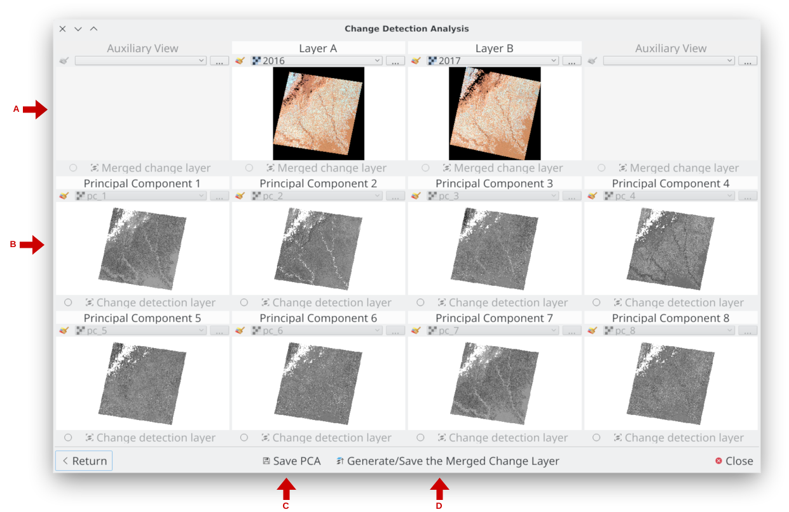

**A. Principal row:** The first row shows the original input layers (A and B) as a visual reference. The displayed layer can be changed freely.

**B. Component rows:** Each subsequent row corresponds to one principal component. The number of rows adjusts to the number of components.

**C. Save PCA:** (Optional) Saves all principal components as a single multi-band GeoTIFF stack.

**D. Generate/Save the Merged Change Layer:** Merges all activated component change layers into the final output (the last step — see below).

### 2a. Generate the change layer by component

Use the principal row as a reference to identify which components best capture the changes of interest.

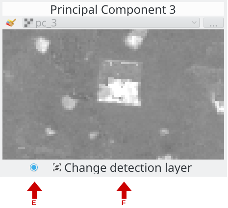

*Example: components 3 and 8 were selected.*

**E. Enable/disable the change layer:** Toggles visibility of the change layer for this component and enables button (F).

**F. Change detection layer:** Opens the Component Analysis dialog for this component.

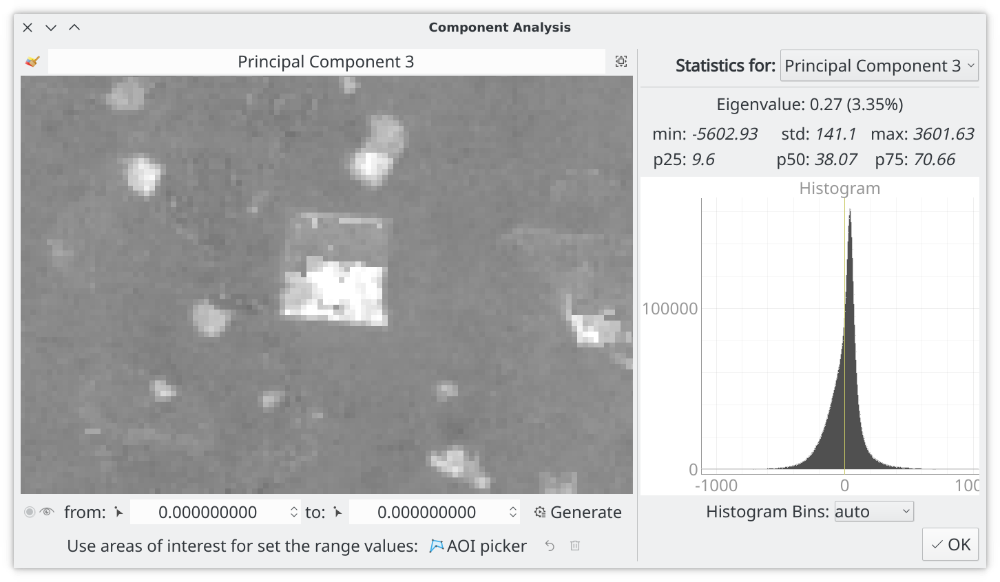

Define the change range (lower and upper bounds) using one of three methods:

1. **Mouse picker:** Use the _from value_ and _to value_ picker tools to click directly on the map. Confirm each value with the left mouse button, then click _Generate_.

    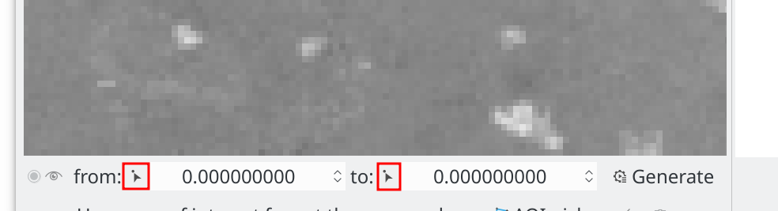

2. **AOI picker:** Draw one or more areas of interest over pixels representing the changes to capture. The plugin automatically derives the min/max range from the AOI pixels and updates the change layer after each new AOI.

    *Controls: left-click to add a vertex, Esc/Backspace to remove the last vertex, right-click to close the AOI.*

    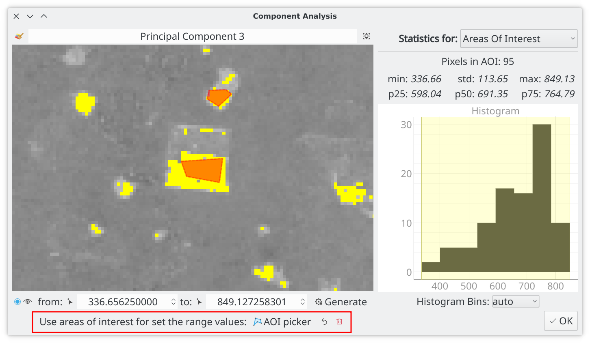

3. **Histogram:** The interactive histogram shows the value distribution. Drag the yellow region to adjust the range — the numeric fields update in real time (and vice versa). Click _Generate_ to apply.

    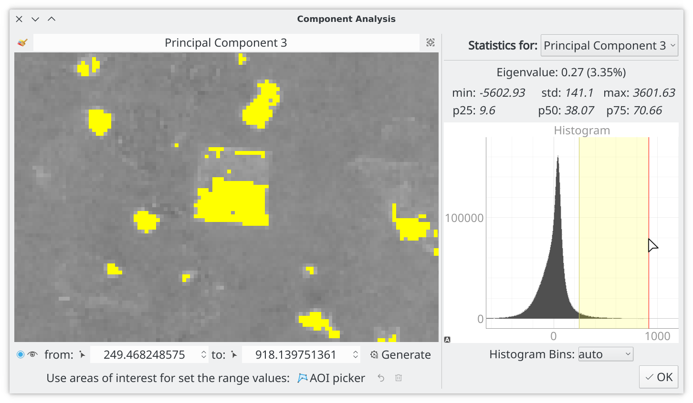

### 2b. Generate the merged change layer

Once all desired component change layers are generated, enable each one with button (E), then click **Generate/Save the Merged Change Layer**.

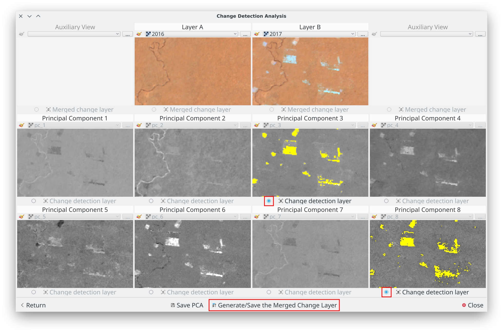

The merge dialog opens:

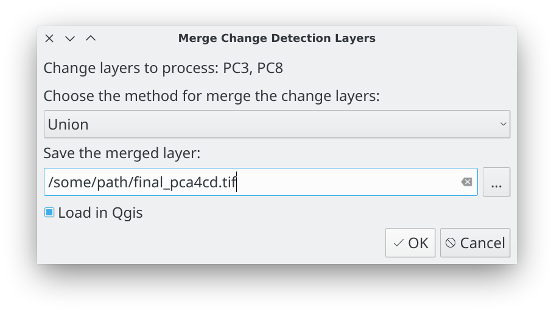

Select the merge method, choose the output file path, and click OK.

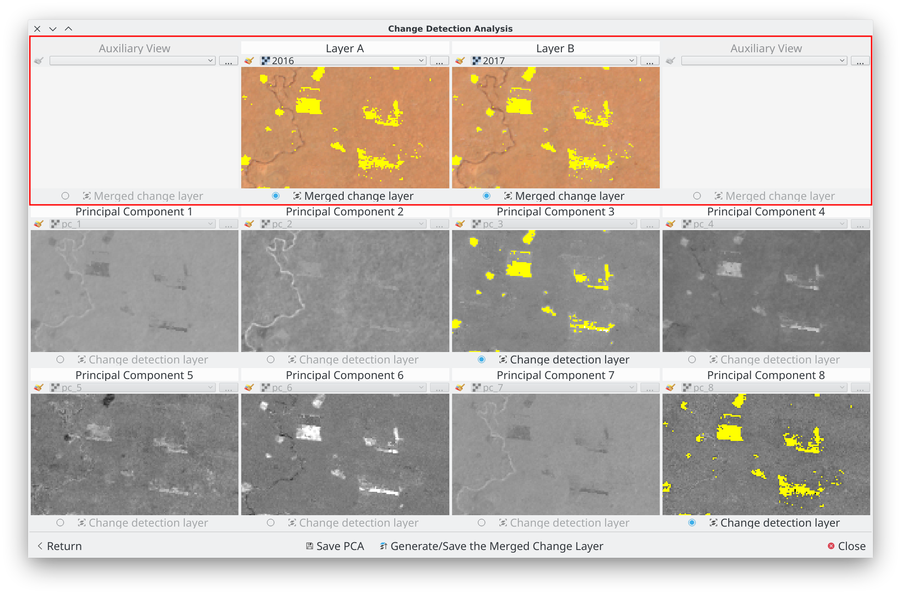

The merged layer is saved, displayed in all first-row views, and optionally loaded into QGIS. You can refine individual component layers and re-merge at any time.

When the result is satisfactory, close the plugin and continue working with the merged layer in QGIS.

## About us

PCA4CD was developed and implemented by the Group of Forest and Carbon Monitoring System (SMByC), operated by the Institute of Hydrology, Meteorology and Environmental Studies (IDEAM) — Colombia.

Author and developer: *Xavier C. Llano* *<xavier.corredor.llano@gmail.com>*  
Theoretical support, testing and product verification: SMByC-PDI group

## License

PCA4CD is free/libre software licensed under the GNU General Public License.
