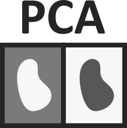

# PCA4CD

The PCA4CD is a Qgis plugin for generate the principal components analysis for change detection

## Index:
- [About](about.md)
- [Installation](installation.md)
- [How to use](how_to_use.md)

## Source code

The official version control system repository of the plugin:
[https://bitbucket.org/smbyc/qgisplugin-pca4cd](https://bitbucket.org/smbyc/qgisplugin-pca4cd)

## The home plugin:

The home plugin in plugins.qgis.org: [http://plugins.qgis.org/plugins/PCA4CD/](http://plugins.qgis.org/plugins/PCA4CD/)

## Issue Tracker

Issues, ideas and enhancements: [https://bitbucket.org/smbyc/qgisplugin-pca4cd/issues](https://bitbucket.org/smbyc/qgisplugin-pca4cd/issues)

## Get involved

The PCA4CD plugin is open source and you can help in different ways:

* help with developing and/or improve the docs cloning the repository and doing the push request ([howto](https://confluence.atlassian.com/bitbucket/fork-a-teammate-s-repository-774243391.html)).
* or just test it, report issues, ideas and enhancements in the issue tracker.

***

Copyright (C) Xavier Corredor Llano <xcorredorl@ideam.gov.co>  
Sistema de Monitoreo de Bosques y Carbono (SMByC)  
General Public License - GPLv3
